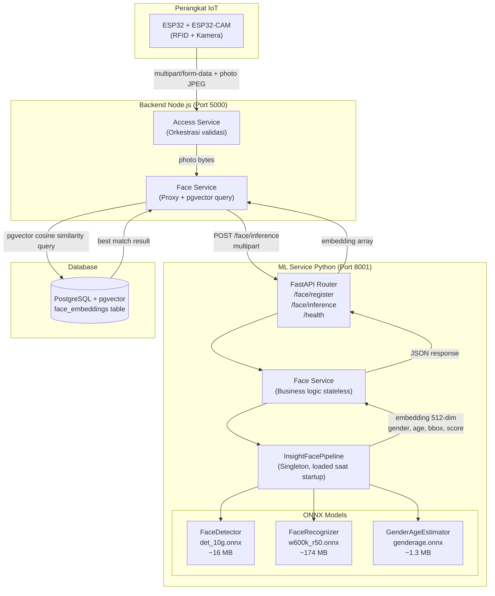
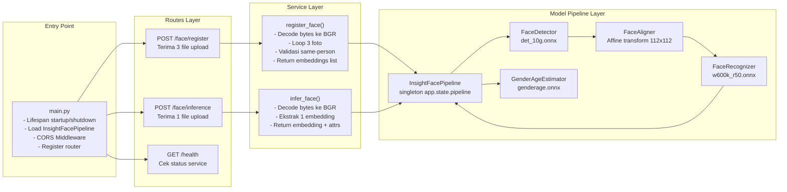
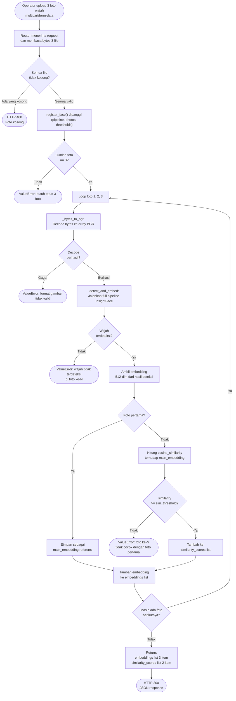
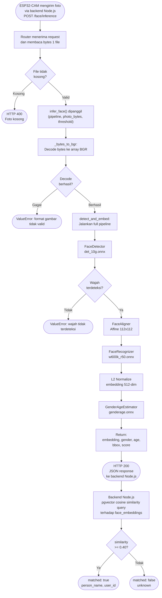
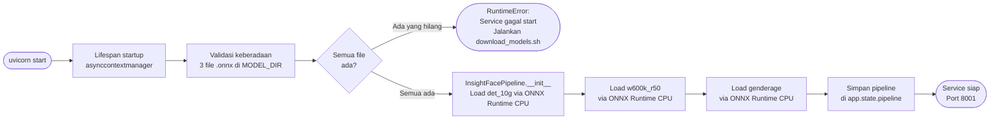
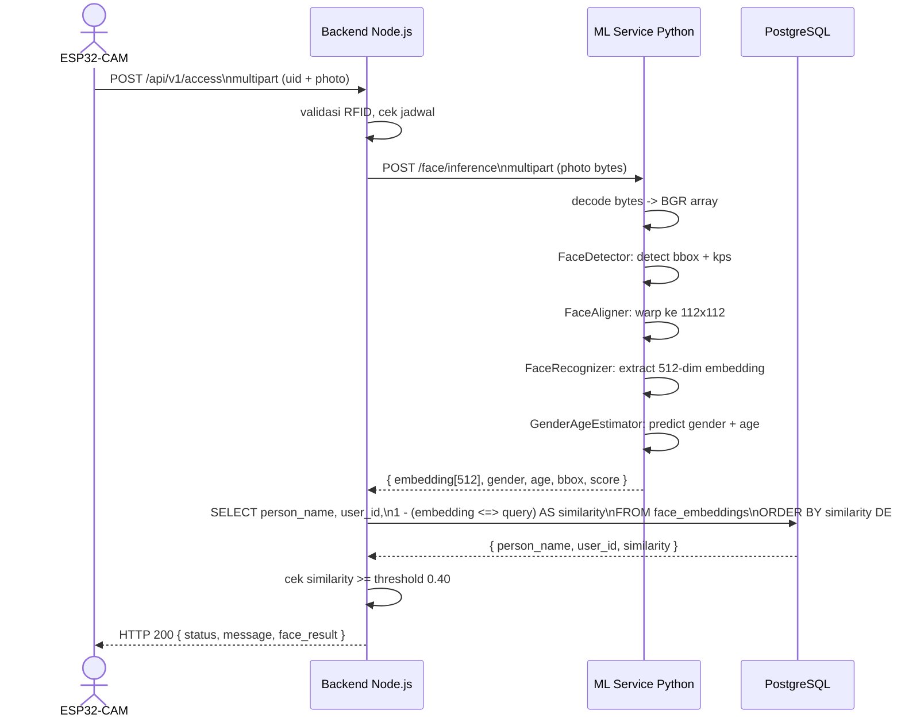

# Dokumentasi Teknis ML Service - Smart Room Access System

**Nama Proyek:** Smart Room Access System - Machine Learning Face Recognition Service  
**Versi:** 1.0.0  
**Runtime:** Python 3.11 + FastAPI  
**Framework Inferensi:** ONNX Runtime 1.17.1  
**Pipeline Model:** InsightFace (det_10g + w600k_r50 + genderage)  
**Tanggal Dokumen:** Juni 2026

---

## Daftar Isi

- [1. Pendahuluan](#1-pendahuluan)
- [2. Arsitektur Sistem ML](#2-arsitektur-sistem-ml)
- [3. Struktur Direktori](#3-struktur-direktori)
- [4. Model ONNX dan Spesifikasi Teknis](#4-model-onnx-dan-spesifikasi-teknis)
- [5. Pipeline Inferensi](#5-pipeline-inferensi)
- [6. Diagram Alir Proses](#6-diagram-alir-proses)
- [7. Referensi API Endpoint](#7-referensi-api-endpoint)
- [8. Metrik Kemiripan Wajah](#8-metrik-kemiripan-wajah)
- [9. Konfigurasi Lingkungan](#9-konfigurasi-lingkungan)
- [10. Panduan Instalasi dan Pengoperasian](#10-panduan-instalasi-dan-pengoperasian)
- [11. Deployment Berbasis Kontainer](#11-deployment-berbasis-kontainer)
- [12. Catatan Teknis dan Pertimbangan](#12-catatan-teknis-dan-pertimbangan)

---

## 1. Pendahuluan

ML Service merupakan komponen tersendiri dalam arsitektur Smart Room Access System yang bertanggung jawab atas seluruh komputasi pengenalan wajah. Layanan ini diimplementasikan sebagai **stateless microservice** berbasis Python FastAPI dan berjalan pada port `8001`, terpisah sepenuhnya dari backend utama Node.js yang beroperasi di port `5000`.

Pemisahan ini dirancang secara sadar agar beban komputasi berat (inferensi model deep learning) tidak menghambat latensi backend utama. Backend Node.js hanya berperan sebagai orkestrasi dan penerus request ke ML Service melalui HTTP internal.

### 1.1 Ruang Lingkup Layanan

Layanan ini menangani dua fungsi komputasi utama:

- **Registrasi wajah** - memproses 3 foto input, mengekstrak vektor embedding 512 dimensi per foto, memvalidasi bahwa ketiga foto merupakan orang yang sama melalui cosine similarity, kemudian mengembalikan hasil embedding ke backend untuk disimpan di basis data
- **Inferensi wajah** - memproses 1 foto query, mengekstrak embedding, dan mengembalikan representasi vektor tersebut ke backend; proses pencocokan terhadap database dilakukan di sisi backend menggunakan operator pgvector PostgreSQL

### 1.2 Batasan Layanan

- Layanan ini bersifat **stateless** dan **tidak memiliki koneksi basis data** secara langsung; seluruh persistensi data dikelola oleh backend Node.js
- Model hanya mendukung format gambar JPEG dan PNG; format lain akan ditolak pada tahap decoding
- Inferensi berjalan menggunakan **CPU Execution Provider** ONNX Runtime; GPU tidak diaktifkan secara default
- Satu request `POST /face/register` memproses tepat 3 foto dan tidak dapat dikonfigurasi
- Model tidak dirancang untuk real-time video stream; setiap request adalah inferensi per-frame terpisah

---

## 2. Arsitektur Sistem ML

### 2.1 Posisi ML Service dalam Ekosistem Keseluruhan



### 2.2 Pola Arsitektur Internal

ML Service mengadopsi pola **Layered Architecture** dengan tiga lapisan yang memiliki tanggung jawab terisolasi:

| Lapisan | File | Tanggung Jawab |
|---------|------|----------------|
| Router | `app/routes/face.py` | Menerima HTTP request, parsing multipart, validasi file, memanggil service, mengirim response JSON |
| Service | `app/services/face_service.py` | Business logic stateless: decode bytes ke array, orkestrasi pipeline, validasi hasil |
| Model Pipeline | `app/models/face_pipeline.py` | Wrapper ONNX Runtime: load model, pre-processing, inferensi, post-processing, NMS |

Pipeline `InsightFacePipeline` dimuat sebagai **singleton saat startup** aplikasi dan disimpan di `app.state.pipeline`. Pendekatan ini memastikan model berat (174 MB) hanya di-load sekali ke memori dan dapat digunakan kembali untuk setiap request tanpa overhead inisialisasi ulang.

### 2.3 Diagram Komponen Internal



---

## 3. Struktur Direktori

```
ml-service-iot-room/
|
|-- main.py                         # Entry point FastAPI - lifespan startup, load pipeline, register router
|-- requirements.txt                # Dependensi Python yang di-pin untuk build reproducible
|-- Dockerfile                      # Build Python 3.11-slim + download model ONNX dari GCS
|-- cloudbuild.yaml                 # CI/CD pipeline Google Cloud Build ke Cloud Run
|-- .env.example                    # Template konfigurasi environment variables
|-- test_pipeline.py                # Script uji end-to-end pipeline secara lokal
|
|-- app/
|   |-- __init__.py
|   |
|   |-- models/
|   |   |-- __init__.py
|   |   `-- face_pipeline.py        # Seluruh wrapper ONNX Runtime:
|   |                               #   - FaceDetector (det_10g)
|   |                               #   - FaceAligner (affine 112x112)
|   |                               #   - FaceRecognizer (w600k_r50)
|   |                               #   - GenderAgeEstimator (genderage)
|   |                               #   - InsightFacePipeline (orchestrator singleton)
|   |
|   |-- services/
|   |   `-- face_service.py         # Business logic stateless:
|   |                               #   - register_face()
|   |                               #   - infer_face()
|   |
|   |-- routes/
|   |   `-- face.py                 # FastAPI APIRouter:
|   |                               #   - POST /face/register
|   |                               #   - POST /face/inference
|   |
|   `-- database/
|       `-- __init__.py             # Placeholder (tidak ada koneksi DB di ML service)
|
`-- ../ml-models/                   # Folder model ONNX (berada di luar direktori service)
    |-- det_10g.onnx                # Face detector - ~16 MB
    |-- w600k_r50.onnx              # Face recognizer - ~174 MB
    |-- genderage.onnx              # Gender & age estimator - ~1.3 MB
    |-- download_models.sh          # Script download dari Alibaba OSS
    `-- inefence-example.py         # Referensi pipeline sebelum refactor
```

---

## 4. Model ONNX dan Spesifikasi Teknis

### 4.1 `det_10g.onnx` - Face Detector

Model RetinaFace multi-scale anchor-based yang digunakan untuk mendeteksi lokasi wajah dalam gambar.

**Arsitektur:** RetinaFace dengan multi-scale feature pyramid  
**Sumber:** InsightFace open-source model zoo

| Parameter | Nilai |
|-----------|-------|
| Input size | 640 x 640 piksel (letterbox) |
| Normalisasi | `(pixel - 127.5) / 128.0` |
| Stride | 8, 16, 32 (multi-scale) |
| Jumlah anchor per sel | 2 |
| NMS threshold | 0.4 |
| Detection threshold default | 0.5 |
| Ukuran file | ~16 MB |

**Output per stride:**
- Score map: confidence per anchor (sebelum sigmoid), shape `(N, 1)`
- Bounding box: koordinat relatif anchor center, shape `(N, 4)`
- Keypoints: 5 titik landmark relatif anchor, shape `(N, 10)`

**Pemetaan output ke stride** berdasarkan jumlah anchor `N`:
- `N = 12800` -> stride 8 (feature map 80 x 80)
- `N = 3200` -> stride 16 (feature map 40 x 40)
- `N = 800` -> stride 32 (feature map 20 x 20)

**Output akhir setelah NMS:** list of `{ bbox: [x1, y1, x2, y2], score: float, kps: (5, 2) }` diurutkan descending berdasarkan score. Lima keypoint yang dideteksi: mata kiri, mata kanan, hidung, sudut mulut kiri, sudut mulut kanan.

### 4.2 `w600k_r50.onnx` - Face Recognizer

Model ArcFace berbasis ResNet50 yang menghasilkan representasi vektor identitas wajah.

**Arsitektur:** ResNet-50 dengan ArcFace loss  
**Dataset pelatihan:** WebFace600K (600.000 identitas)  
**Sumber:** InsightFace open-source model zoo

| Parameter | Nilai |
|-----------|-------|
| Input size | 112 x 112 piksel (aligned) |
| Normalisasi | `(pixel - 127.5) / 127.5` |
| Dimensi output | 512 float32 |
| Post-processing | L2 normalization (unit vector) |
| Ukuran file | ~174 MB |

**Karakteristik embedding:**
- Embedding yang dihasilkan adalah unit vector (magnitude = 1.0) setelah L2 normalization
- Jarak antar identitas diukur menggunakan cosine similarity
- Embedding tidak mengandung informasi atribut seperti gender atau usia; fungsi model ini murni mengkodekan identitas

### 4.3 `genderage.onnx` - Gender dan Age Estimator

Model ringan untuk estimasi atribut demografis sebagai informasi tambahan yang bersifat opsional terhadap hasil pencocokan identitas.

| Parameter | Nilai |
|-----------|-------|
| Input size | 96 x 96 piksel |
| Normalisasi | `(pixel - 127.5) / 127.5` |
| Output | Tensor 1D |
| Ukuran file | ~1.3 MB |

**Interpretasi output:**
- `output[0]` - gender score (sigmoid); nilai `> 0.5` dikategorikan sebagai `male`, sebaliknya `female`
- `output[2]` - age score; dikalikan 100 menghasilkan estimasi usia dalam satuan tahun (integer)

> Estimasi usia bersifat aproksimasi dan tidak berpengaruh terhadap keputusan pencocokan identitas.

---

## 5. Pipeline Inferensi

### 5.1 Alur Pemrosesan Lengkap

Setiap request foto melewati empat tahap berurutan yang diorkestrasikan oleh `InsightFacePipeline.detect_and_embed()`:

```
Input: foto JPEG/PNG (bytes)
        |
        v
[Pra-pemrosesan]
- cv2.imdecode: decode bytes ke array BGR (H, W, 3)
- Letterbox resize ke 640 x 640 (mempertahankan rasio aspek)
- Normalisasi: (pixel - 127.5) / 128.0
- Transpose ke (1, 3, H, W) untuk ONNX input
        |
        v
[Tahap 1: FaceDetector - det_10g.onnx]
- Inferensi ONNX menghasilkan 9 output tensor (3 stride x 3 jenis)
- Pemetaan tensor berdasarkan shape (N untuk score, N,4 untuk bbox, N,10 untuk kps)
- Sigmoid activation pada score
- Filter anchor dengan score >= detection_threshold (default 0.5)
- Decode bbox dan keypoints dari koordinat relatif ke piksel absolut
- Non-Maximum Suppression (NMS) dengan IoU threshold 0.4
- Inverse scale untuk mengembalikan koordinat ke dimensi gambar asli
- Pilih deteksi terbaik (score tertinggi)
        |
        v
[Tahap 2: FaceAligner]
- Estimasi affine matrix dari 5 keypoints yang terdeteksi ke 5 reference landmarks ArcFace standard
- cv2.estimateAffinePartial2D dengan metode LMEDS
- cv2.warpAffine: crop dan warp wajah ke ukuran 112 x 112 piksel
        |
        v
[Tahap 3: FaceRecognizer - w600k_r50.onnx]
- Normalisasi: (pixel - 127.5) / 127.5
- Transpose ke (1, 3, 112, 112)
- Inferensi ONNX menghasilkan vektor 512 float32
- L2 normalization: v_norm = v / ||v||_2
        |
        v
[Tahap 4: GenderAgeEstimator - genderage.onnx]
- Resize wajah aligned ke 96 x 96
- Normalisasi dan inferensi ONNX
- Decode gender dari output[0] > 0.5
- Decode age dari output[2] * 100
        |
        v
Output: {
  embedding : np.ndarray(512,) - L2 normalized
  bbox      : [x1, y1, x2, y2]
  score     : float (detection confidence)
  gender    : "male" | "female"
  age       : int
}
```

### 5.2 Reference Landmarks ArcFace

Affine transform menggunakan 5 titik referensi standar InsightFace untuk menghasilkan penyelarasan wajah yang konsisten di seluruh variasi pose:

| Keypoint | Koordinat Referensi (x, y) |
|----------|---------------------------|
| Mata kiri | (38.29, 51.70) |
| Mata kanan | (73.53, 51.50) |
| Hidung | (56.03, 71.74) |
| Sudut mulut kiri | (41.55, 92.37) |
| Sudut mulut kanan | (70.73, 92.20) |

Penggunaan referensi yang tetap memastikan bahwa embedding yang dihasilkan tidak terpengaruh oleh variasi posisi wajah dalam frame sehingga meningkatkan konsistensi cosine similarity antar foto dari orang yang sama.

### 5.3 Penanganan Multi-Anchor pada Decoder

Implementasi decoder bbox (`_decode_boxes`) dan keypoints (`_decode_keypoints`) menggunakan formulasi:

```
# Decode bounding box
x1 = anchor_cx - pred_x1 * stride
y1 = anchor_cy - pred_y1 * stride
x2 = anchor_cx + pred_x2 * stride
y2 = anchor_cy + pred_y2 * stride

# Decode keypoints (per titik)
kp_x = anchor_cx + kp_dx * stride
kp_y = anchor_cy + kp_dy * stride
```

Anchor center di-generate menggunakan `_generate_anchors()` yang menghasilkan grid `H*W*2` anchor per stride dengan offset tengah (`stride // 2`).

---

## 6. Diagram Alir Proses

### 6.1 Alur Registrasi Wajah (POST /face/register)



### 6.2 Alur Inferensi Wajah (POST /face/inference)



### 6.3 Alur Startup Service



### 6.4 Diagram Sekuens Integrasi dengan Backend



---

## 7. Referensi API Endpoint

**Base URL (lokal):** `http://localhost:8001`  
**Dokumentasi Interaktif:** `http://localhost:8001/docs` (Swagger UI otomatis dari FastAPI)

### 7.1 Ringkasan Endpoint

| Method | Endpoint | Deskripsi | Klien |
|--------|----------|-----------|-------|
| `POST` | `/face/register` | Ekstrak embedding dari 3 foto, validasi same-person | Backend Node.js / Operator |
| `POST` | `/face/inference` | Ekstrak embedding dari 1 foto | Backend Node.js |
| `GET` | `/health` | Cek status service dan MODEL_DIR | Monitoring |

### 7.2 POST /face/register

Memproses 3 foto wajah dari orang yang sama dan mengembalikan 3 array embedding. Endpoint ini bersifat stateless; tidak ada data yang disimpan di ML service.

**Content-Type:** `multipart/form-data`

**Request fields:**

| Field | Tipe | Wajib | Keterangan |
|-------|------|-------|------------|
| `photo_1` | file (JPEG/PNG) | Ya | Foto pertama, idealnya menghadap depan |
| `photo_2` | file (JPEG/PNG) | Ya | Foto kedua, sudut berbeda |
| `photo_3` | file (JPEG/PNG) | Ya | Foto ketiga, sudut berbeda |

**Response 200 - berhasil:**

```json
{
  "success": true,
  "message": "Embeddings extracted successfully",
  "data": {
    "embeddings": [
      [0.0231, -0.0134, ..., 0.0089],
      [0.0219, -0.0128, ..., 0.0091],
      [0.0228, -0.0131, ..., 0.0087]
    ],
    "similarity_scores": [0.8732, 0.8614]
  }
}
```

> `similarity_scores[0]` = cosine similarity foto 1 vs foto 2  
> `similarity_scores[1]` = cosine similarity foto 1 vs foto 3  
> Nilai minimum yang diterima: `>= MATCH_THRESHOLD` (default `0.40`)

**Response 400 - file kosong:**

```json
{
  "detail": "Foto ke-2 kosong"
}
```

**Response 422 - foto berbeda orang:**

```json
{
  "detail": "Foto ke-2 tidak cocok dengan foto pertama (similarity=0.23 < threshold=0.40). Pastikan ketiga foto adalah orang yang sama."
}
```

**Response 422 - wajah tidak terdeteksi:**

```json
{
  "detail": "Wajah tidak terdeteksi di foto ke-1"
}
```

### 7.3 POST /face/inference

Memproses 1 foto dan mengembalikan embedding beserta atribut deteksi. Pencocokan terhadap database tidak dilakukan di ML service.

**Content-Type:** `multipart/form-data`

**Request fields:**

| Field | Tipe | Wajib | Keterangan |
|-------|------|-------|------------|
| `photo` | file (JPEG/PNG) | Ya | Foto wajah untuk dikenali |

**Response 200 - berhasil:**

```json
{
  "success": true,
  "message": "Face embedding extracted successfully",
  "data": {
    "embedding": [0.0231, -0.0134, ..., 0.0089],
    "gender": "male",
    "age": 24,
    "bbox": [120.5, 80.3, 340.2, 420.1],
    "score": 0.9823
  }
}
```

> `embedding` - array 512 float32 L2-normalized  
> `bbox` - koordinat piksel `[x1, y1, x2, y2]`, dibulatkan 1 desimal  
> `score` - confidence deteksi wajah dari `det_10g.onnx`  
> `gender` - `"male"` atau `"female"` dari `genderage.onnx`  
> `age` - estimasi usia dalam tahun (integer)

**Response 422 - wajah tidak terdeteksi:**

```json
{
  "detail": "Wajah tidak terdeteksi di foto yang diberikan"
}
```

### 7.4 GET /health

```json
{
  "status": "ok",
  "model_dir": "/app/models"
}
```

---

## 8. Metrik Kemiripan Wajah

### 8.1 Cosine Similarity

Pipeline menggunakan cosine similarity yang di-skala ke rentang `[0, 1]` sebagai metrik pencocokan identitas:

```
L2 Normalize:
  v_norm = v / ||v||_2

Cosine Similarity:
  raw_cosine = dot(a_norm, b_norm)      # range [-1.0, 1.0]
  similarity  = (raw_cosine + 1.0) / 2  # rescale ke [0.0, 1.0]
```

Penskalaan ke `[0, 1]` dilakukan untuk mempermudah interpretasi threshold tanpa nilai negatif. Nilai `1.0` berarti dua embedding identik; nilai `0.5` berarti tidak berkorelasi; nilai `< 0.5` berarti berbeda arah (sangat tidak mirip dalam konteks identitas wajah).

### 8.2 Threshold yang Digunakan

| Konteks | Threshold | Variabel Lingkungan |
|---------|-----------|---------------------|
| Validasi antar foto saat registrasi | `>= 0.40` | `MATCH_THRESHOLD` |
| Pencocokan di backend pgvector | `>= 0.40` | Dikonfigurasi di backend |
| Detection confidence wajah | `>= 0.5` | `DETECTION_THRESHOLD` |

> Nilai threshold `0.40` mengikuti konfigurasi pipeline InsightFace (cermin-new) yang menjadi referensi implementasi. Nilai ini dapat disesuaikan via environment variable untuk trade-off antara False Accept Rate (FAR) dan False Reject Rate (FRR).

### 8.3 Perbandingan dengan Pipeline Lama

| Aspek | Pipeline Baru (InsightFace ONNX) | Pipeline Lama (face-api.js) |
|-------|----------------------------------|------------------------------|
| Dimensi embedding | 512 float32 | 128 float32 |
| Metrik kecocokan | Cosine similarity `>= 0.40` | Euclidean distance `<= 0.42` |
| Model recognizer | ArcFace ResNet50 (w600k_r50) | SSD Mobilenet |
| Penyimpanan | pgvector `vector(512)` | JSON text |
| Kompatibilitas | **Tidak kompatibel** dengan embedding lama | - |

> Embedding dari kedua pipeline **tidak dapat dicampurkan**. Jika terdapat data embedding dari pipeline lama, diperlukan proses re-registrasi ulang seluruh wajah menggunakan pipeline baru.

---

## 9. Konfigurasi Lingkungan

Konfigurasi dilakukan melalui file `.env` di direktori `ml-service-iot-room/`. Template tersedia di `.env.example`.

| Variabel | Default | Keterangan |
|----------|---------|------------|
| `PORT` | `8001` | Port server uvicorn |
| `MODEL_DIR` | `../../ml-models` | Path ke folder yang berisi file `.onnx` |
| `MATCH_THRESHOLD` | `0.40` | Threshold cosine similarity minimum untuk registrasi |
| `DETECTION_THRESHOLD` | `0.5` | Threshold minimum confidence face detection |
| `DATABASE_URL` | - | Tidak digunakan di ML service (placeholder) |

**Contoh konfigurasi pengembangan lokal:**

```env
PORT=8001
MODEL_DIR=../../ml-models
MATCH_THRESHOLD=0.40
DETECTION_THRESHOLD=0.5
```

**Konfigurasi production (Docker / Cloud Run):**

Variabel `MODEL_DIR` dan `PORT` ditetapkan langsung di `Dockerfile` melalui instruksi `ENV`:

```dockerfile
ENV MODEL_DIR=/app/models
ENV PORT=8001
```

---

## 10. Panduan Instalasi dan Pengoperasian

### 10.1 Prasyarat

- Python 3.11 atau lebih baru
- pip dan venv
- File model ONNX tersedia (lihat langkah 3)

### 10.2 Langkah Instalasi

**Langkah 1 - Clone dan masuk ke direktori:**

```bash
cd ml-service-iot-room
```

**Langkah 2 - Buat virtual environment dan install dependensi:**

```bash
python -m venv venv
source venv/bin/activate          # Linux / macOS
# atau: venv\Scripts\activate     # Windows

pip install -r requirements.txt
```

**Langkah 3 - Download model ONNX:**

```bash
cd ../ml-models
./download_models.sh
```

Script akan mengunduh tiga file berikut ke folder `ml-models/`:
- `det_10g.onnx` (~16 MB)
- `w600k_r50.onnx` (~174 MB)
- `genderage.onnx` (~1.3 MB)

**Langkah 4 - Konfigurasi environment:**

```bash
cd ../ml-service-iot-room
cp .env.example .env
# edit .env sesuai path lokal jika diperlukan
```

**Langkah 5 - Jalankan service:**

```bash
uvicorn main:app --host 0.0.0.0 --port 8001 --reload
```

Atau secara langsung:

```bash
python main.py
```

Service tersedia di `http://localhost:8001`  
Swagger UI tersedia di `http://localhost:8001/docs`

### 10.3 Menjalankan Keseluruhan Sistem Secara Lokal

```bash
# Terminal 1 - Backend Node.js
cd smart-room-access-backend
npm run dev

# Terminal 2 - ML Service Python
cd ml-service-iot-room
source venv/bin/activate
uvicorn main:app --host 0.0.0.0 --port 8001 --reload
```

Setelah keduanya berjalan, endpoint face dapat diakses melalui:
- Langsung ke ML service: `http://localhost:8001/face/register`
- Melalui proxy Node.js: `http://localhost:5000/api/v1/face/register`

### 10.4 Pengujian Pipeline

```bash
# Uji end-to-end pipeline secara lokal
python test_pipeline.py
```

**Contoh pengujian dengan curl:**

```bash
# Inferensi wajah dari 1 foto
curl -X POST http://localhost:8001/face/inference \
  -F "photo=@test.jpg"

# Registrasi wajah dari 3 foto
curl -X POST http://localhost:8001/face/register \
  -F "photo_1=@foto1.jpg" \
  -F "photo_2=@foto2.jpg" \
  -F "photo_3=@foto3.jpg"

# Health check
curl http://localhost:8001/health
```

---

## 11. Deployment Berbasis Kontainer

### 11.1 Arsitektur Docker

Dockerfile menggunakan base image `python:3.11-slim` dengan pendekatan berikut:
- Model ONNX **tidak di-commit ke repository** karena ukurannya yang besar (~192 MB total)
- Model di-download langsung dari Google Cloud Storage (bucket `ml-models-iot`) saat proses `docker build`
- Service dijalankan sebagai **non-root user** (`mluser`, UID 1001) untuk keamanan

### 11.2 Build dan Jalankan Secara Lokal

```bash
# Build image
docker build -t ml-service:latest .

# Jalankan container
docker run -p 8001:8001 \
  -e MODEL_DIR=/app/models \
  ml-service:latest
```

### 11.3 CI/CD dengan Google Cloud Build

Pipeline CI/CD dikonfigurasi melalui `cloudbuild.yaml` dengan tiga tahap:

| Tahap | Alat | Keterangan |
|-------|------|------------|
| `build` | `gcr.io/cloud-builders/docker` | Build image Docker, model di-download dari GCS via `ARG GCS_BUCKET` |
| `push` | `gcr.io/cloud-builders/docker` | Push image ke Artifact Registry dengan tag `$COMMIT_SHA` dan `latest` |
| `deploy` | `gcr.io/cloud-builders/gcloud` | Deploy ke Google Cloud Run di region `asia-southeast1` |

**Spesifikasi Cloud Run:**

| Parameter | Nilai |
|-----------|-------|
| Region | `asia-southeast1` |
| Memory | 2 GiB |
| CPU | 2 vCPU |
| Concurrency | 10 request per instance |
| Timeout | 60 detik per request |
| Service account | Cloud Build default (akses GCS otomatis) |

**Sebelum deploy pertama kali**, upload model ke GCS:

```bash
gsutil cp ml-models/*.onnx gs://ml-models-iot/
```

### 11.4 Health Check Container

```dockerfile
HEALTHCHECK --interval=30s --timeout=10s --start-period=30s --retries=3 \
  CMD python -c "import urllib.request; urllib.request.urlopen('http://localhost:8001/health')" || exit 1
```

Container dinyatakan sehat setelah `GET /health` mengembalikan respons valid dalam waktu `start-period` 30 detik (waktu yang dibutuhkan untuk load model besar ke memori).

---

## 12. Catatan Teknis dan Pertimbangan

### 12.1 Singleton Pattern untuk Pipeline

`InsightFacePipeline` dimuat sebagai singleton menggunakan mekanisme `lifespan` FastAPI dan disimpan di `app.state.pipeline`. Setiap request mengakses pipeline yang sama tanpa reinisialisasi. Pendekatan ini krusial karena:
- Load `w600k_r50.onnx` memerlukan waktu dan memori signifikan (~174 MB)
- ONNX Runtime session yang sudah dimuat thread-safe untuk concurrent inference
- `app.state` adalah cara idiomatis FastAPI untuk shared state antar request

### 12.2 Stateless Design

ML service tidak menyimpan state apapun antara request. Tidak ada koneksi ke basis data, tidak ada cache embedding, dan tidak ada session. Seluruh data embedding yang dihasilkan langsung dikembalikan ke backend Node.js yang bertanggung jawab atas persistensi menggunakan PostgreSQL dengan ekstensi pgvector.

Desain stateless ini memiliki implikasi:
- Service dapat di-scale horizontal tanpa sinkronisasi state
- Tidak ada risiko data inconsistency akibat crash service
- Setiap instance Cloud Run yang baru hanya perlu load model saat startup

### 12.3 Pemetaan Output ONNX Secara Dinamis

Implementasi `FaceDetector.detect()` menggunakan pemetaan output ONNX berdasarkan shape tensor, bukan berdasarkan nama output. Ini dilakukan karena nama output tensor dapat berubah tergantung versi eksportir ONNX. Pemetaan berdasarkan jumlah anchor `N` (12800, 3200, 800) dan dimensi kolom (1, 4, atau 10) lebih stabil:

```python
for out in outputs:
    shape = out.shape
    if len(shape) == 2:
        N = shape[0]
        if N == 12800:   stride = 8
        elif N == 3200:  stride = 16
        elif N == 800:   stride = 32
        ...
        if shape[1] == 1:   score_maps[stride] = out
        elif shape[1] == 4:  bbox_maps[stride] = out
        elif shape[1] == 10: kps_maps[stride] = out
```

### 12.4 Penanganan Error dan HTTP Status Code

| Kondisi | Status Code | Mekanisme |
|---------|-------------|-----------|
| File upload kosong | 400 | Cek `len(photo_bytes) == 0` di router |
| Format gambar tidak valid | 422 | `ValueError` dari `_bytes_to_bgr()` ditangkap di router |
| Wajah tidak terdeteksi | 422 | `ValueError` dari service ditangkap di router |
| Foto berbeda orang saat registrasi | 422 | `ValueError` dari `register_face()` |
| Error tidak terduga | 500 | Exception umum ditangkap dengan detail pesan |

### 12.5 Dependensi dan Versi yang Di-pin

Seluruh dependensi di-pin ke versi spesifik di `requirements.txt` untuk memastikan build yang reproducible:

| Paket | Versi |
|-------|-------|
| `fastapi` | 0.110.0 |
| `uvicorn` | 0.29.0 |
| `python-multipart` | 0.0.9 |
| `numpy` | 1.26.4 |
| `opencv-python-headless` | 4.9.0.80 |
| `onnxruntime` | 1.17.1 |
| `python-dotenv` | 1.0.1 |

> `opencv-python-headless` digunakan sebagai pengganti `opencv-python` untuk menghindari dependensi terhadap pustaka GUI (`libqt`, `libGL`) yang tidak tersedia di environment server minimal.

### 12.6 Limitasi Kinerja

- Inferensi satu foto (detect + align + recognize + gender-age) memerlukan waktu sekitar 200-500 ms pada CPU standar, tergantung ukuran gambar input
- `onnxruntime` CPU provider tidak memanfaatkan GPU; jika kinerja menjadi bottleneck, opsi pertama adalah mengganti ke `CUDAExecutionProvider` pada instance dengan GPU
- Pada Cloud Run, concurrency 10 dengan CPU 2 vCPU berarti permintaan yang datang bersamaan akan terbagi bebannya; waktu respons P95 dapat meningkat pada traffic tinggi
